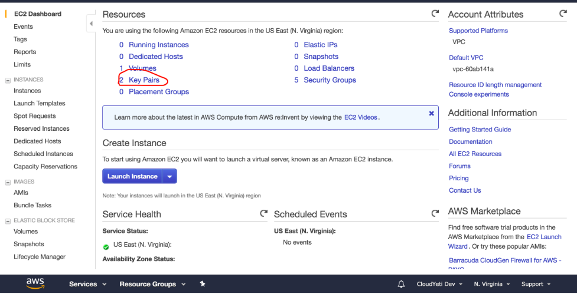
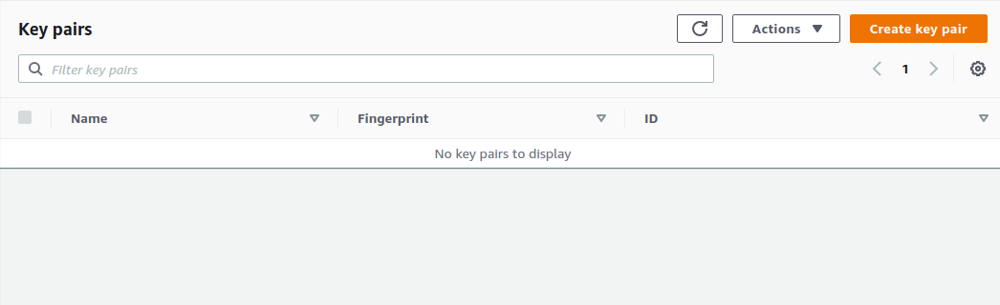
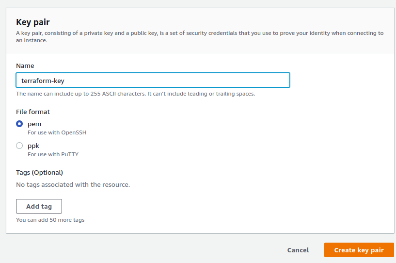
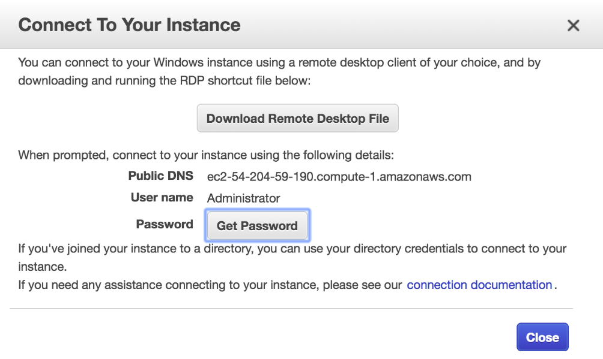
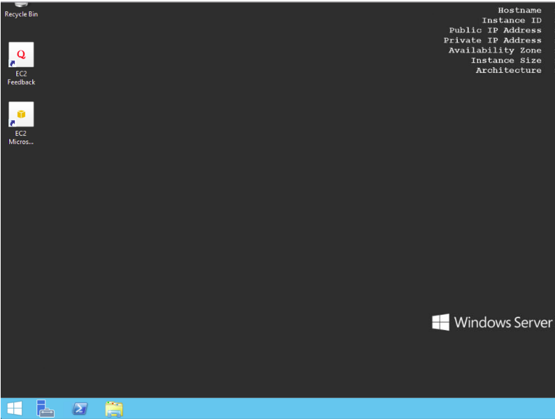

Na [Último Laboratório ](https://github.com/pmarcelojr/terraform-aws-labs/blob/master/Lab001/README.md), lançamos uma instância EC2 básica com o Terraform. Neste laboratório, iniciaremos a instância do EC2 do Windows e liberar a porta RDP. Se não estiver com o seu ambiente preparado vá até o [Primeiro Laboratório ](https://github.com/pmarcelojr/terraform-aws-labs/blob/master/Lab001/README.md).  


## Passos: 

1) Vá para o console de gerenciamento da AWS, navegue até o painel do EC2 e clique em pares de chaves (Key Pairs). Clique em criar par de chaves (Key Pair). Digite um nome como Terraform-key e clique em criar. 




Isso fará o download de um arquivo para a pasta de downloads padrão do computador.. 

2) No painel EC2, clique em iniciar instância e encontr um AMI do Windows 2019 (ou qualquer AMI do Windows) em sua região selecionada. Anote a id da AMI. Na região us-east-1, escolhi o Microsoft Windows Server 2019 - Base - **ami-0eb7fbcc77e5e6ec6**.
3) Crie uma nova pasta, copie o arquivo de chave baixado para está pasta. Na mesma pasta, crie um arquivo de texto com um nome como windows.tf e cole o código abaixo. Observer que isso é muito semelhante ao código da primeira lição. Substitura o ami-id se você estiver em uma região diferente.

```HCL
terraform {
  required_providers {
    aws = {
      source = "hashicorp/aws"
      version = "~> 3.0"
    }
  }
}


provider "aws" {
  access_key = "ACCESS_KEY_HERE"
  secret_key = "SECRET_KEY_HERE"
  region     = "us-east-1"
}

# Microsoft Windows Server 2019 Base
resource "aws_instance" "example" {
  ami           = "ami-0eb7fbcc77e5e6ec6"
  instance_type = "t2.micro"
  key_name = "terraform-key"
  security_groups = ["${aws_security_group.allow_rdp.name}"]

}

resource "aws_security_group" "allow_rdp" {
  name        = "allow_rdp"
  description = "Allow rdp traffic"


  ingress {

    from_port   = 3389 #  TCP port 3389 para RDP
    to_port     = 3389
    protocol =   "tcp"

    cidr_blocks =  ["0.0.0.0/0"]
  }
}
```

4) Depois de criar o arquivo windows.tf, salve-o. Certifique-se de ter suas credenciais da AWS inseridas corretamente. Então use este comando abaixo: 
```
terraform apply --auto-approve 
```

O sinalizador **Auto approve** ignora a pergunta sim/não.

5) Vá para o console de gerenciamento da AWS. Um EC2 deve estar rodando. Aguarde 5 minutos (A instancia Windows leva cerca de 5 minutos para ficar pronta). Em seguida, selecione a instância EC2 e clique em Conectar. 
- Clique em Descriptografar Senha (Decrypt passoword). 
- Escolha o arquivo .pem que você baixou anteriormente e carregue-o para descriptografar a senha.
- Depois de obter a senha, baixe o arquivo RDP.
- Abra o arquivo RDP baixado. A senha será solicitada quando a área de trabalho remota do Windows for executada. Forneça a senha.
Obeservação: Se você não tiver a área de trabalho remota instalada, é necessário instalá-la. 




6) Você deve estar logado agora. 

7) Vamos destruir os recursos da AWS com o seguinte comando:
```
terraform destroy
```


## Novos conceitos introduzidos
- Como criar grupos de segurança 
- Dependência de recursos. Referimo-nos ao SG com **aws_security_group.example.id**